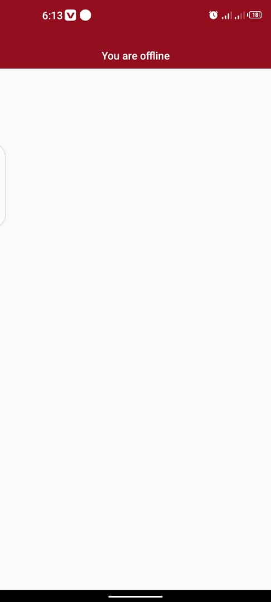

# react-native-offlinebar

<h2>A React Native component to display offline or online status on mobile devices.</h2>

## Installation

Install the package via npm:

```bash
    npm install react-native-offlinebar
    Or via yarn:
    yarn add react-native-offlinebar
```
<h3>Usage</h3>
Import OfflineBar in your React Native component:

```javascript

import React from 'react';
import { View } from 'react-native';
import OfflineBar from 'react-native-offlinebar';

const App = () => {
    return (
        <View style={{ flex: 1 }}>
            <OfflineBar bgColor="#930F1F" color="#fff" title="You must connect to Wi-Fi or a cellular network to get online again" />
            {/* Your other components */}
        </View>
    );
};

export default App;
```
<h5>All props are optional:</h5>
<ul>
<li><b>bgColor</b>: Background color of the offline bar.</li>
<li><b>color</b></b>: Text color of the offline message.</li>
<li><b>title</b></b>: Offline message to display.</li>
</ul>

Modify the props as needed to customize the appearance and message of OfflineBar in your application.

<br>
<h3> Preview</h3>
<div style="text-align: center;">
    
</div>